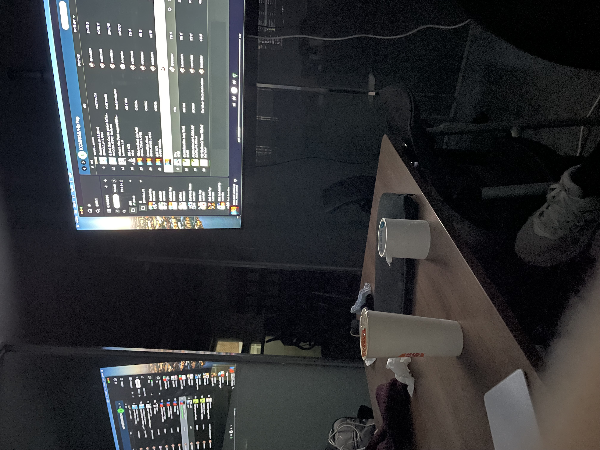

# 📺 2023년

회고를 적어봤는데 너무 개발분야만 적은거같은데 일상을 넣자니 애매해서 따로 만들었다.

평소에 노래듣는거나 드라마/영화 보는거를 많이 좋아해서 아마 이 내용이  주를 이룰 것 같다.


#### 1월

방학이라 시간이 좀 많아서 이것저것 많이 봤던거같다. 좀더 봤는데 기억이 안난다.

```
드라마 : 그 남자의 기억법, 사랑의 이해, 쌈 마이웨이, 안나 감독판
영화  : 돌연변이
예능  : 공범, 보물찾기, 피지컬 100, 런닝맨 정주행
```

기타나 피아노도 간간이 연습했고 피아노는 쇼팽발라드1번,3번이 맘에들어서 연습했다.


이때 노래도 많이 듣고 찾았는데 그러다보니까 기존에 플리정리해놓은게 감당이 안됬다. 곡이 너무 많아지고 찾기도 어려워서 어떻게 정리할까  고민좀 하다가 장르별로 나누면 좋겠다 생각이 들어서 노래 장르에 대해 공부좀 한다음에&#x20;

<div align="left">

<figure><figcaption></figcaption></figure>

 

<figure><figcaption></figcaption></figure>

</div>

이런식으로 장르/분위기와 한국곡은 K 붙여서 나누기로했다. 지금까지도 잘쓰고있어서 이때 잘 나눈것 같다.


이때 많이 들은 노래

```
Post Malone - Myself
Leellamarz - 분리불안, Like the firtst time, Time limit, Ex, HAVE A GOOD TRIP
Sam Smith - Promises
Drake - Passionfruit, Get It Together
The Weeknd - Can't Feel My Face
양다일 - 괴로워
```

#### 2월


2월은 프로젝트하느라 좀 바빠서 중반까지는 프로젝트만했던것같다.

dotori-v2 프로젝트 내파트랑 공동파트 작업이 끝난뒤엔 좀 풀려서 롤을좀 돌렸던 기억이 난다.

이번달은 뭘 보진 않았던 것 같다.

다음달부터 투두매이트작성을 잘안해서 기억이 잘 안난다.

#### 3월

<pre><code><strong>드라마 : 사랑이라 말해요
</strong></code></pre>

4월

```
드라마 : 세브란스
```

5월

```
영화 : 소울메이트
예능 : 피의 게임
```

6월

```
영화 : 범죄도시 1,2,3
책 : 돈의 심리학, 도파민네이션
```

이떄 친구들이랑 범죄도시 3을봤는데 별로재미없길레 1,2 를 봐봤다. 확실히 전작이 더 재밌었던것 같다.

할게없어서 책도 좀 봐봤다.

또 할게없어서 롤체를 많이했더니 롤체 마스터도 찍어보기도 했다.

<div align="left">

<figure><figcaption></figcaption></figure>

</div>

8월&#x20;

```
드라마 : 나의 아저씨, 또 오해영
```

9월

```
드라마 : 너의 시간 속으로
영화 : 콘크리트 유토피아
```

10월

```
예능 : 데블스 플랜
```

회사다니면서 마땅히 볼게없었는데 그나마 데블스 플랜이 나와서 재밌게봤다.


그전까진 취업해도 실감이 잘 안났는데 서울가니까 확실히 실감이 났고 좀 떨리기도 했다.

회사 2틀째에 지각할뻔했다. 다행이 집이 회사랑 걸어서 10분거리라 지각은 면했지만 그때 이후로 생활패턴이 좀 깨진것 같다.&#x20;

점심은 회사근처에서 먹었는데 거의 매일 다른식당에가서 먹었다. 홍대거리라서 식당도많고 가격도 좀 나갔다. 약간 인스타용 식당도 있었다.

저녁은 따로 해먹기도 귀찮아서 대부분 햄버거나 한솥을 사먹었다.


11월

학교돌아간 이후에서 좀 많이 봤던것 같다.

```
드라마 : 최악의 악, 반짝이는 워터멜론, 
영화 : 벌새, 러브레터
```


그리고 이때가 롤드컵 본선할때였는데 모여서 보자애기가 나와서 장소를 정하다가 학교 홈베에 있는 큰 모니터로 보자고 얘기가 나왔고 4강전이랑 결승전을 모여서 햄버거나 치킨먹으면서 봤다.

<div align="left">

<figure><figcaption></figcaption></figure>

</div>

12월

```
드라마 : 밤이 되었습니다, 봄밤
영화 : 괴인, 혼자사는 사람들, 다음 소희, 화란, 그녀, 죄많은 소녀, 소공녀, 글래스, 그린북
예능 : 대학전쟁, 악뮤의 오날오밤
책 : 수레바퀴 아래서, 인간실격
```

이때 WTM 을 하고있을때라 데이터추가할려고 일부로 좋은평에 영화만 찾아보기도했다.&#x20;

일상이랄게 없는게 평일에 학교다니면서 아침에 일어나서 급식먹고 좀 잔뒤에 11시정도에 일어나서 개발좀 하다가 급식먹고 탁구좀 친다음 개발하고 자습때 얘들이랑 잡담하다가 급식먹고개발좀 한다음 기숙사가서 씻은 후에 개발좀하다가 자는하루가 계속됬다.

이런하루가 현장실습가기 전에는 좀 싫기도 하고 지루했지만 갔다 와보니까 정말 편한거구나를 느껴서 좋았다.


#### 마무리


