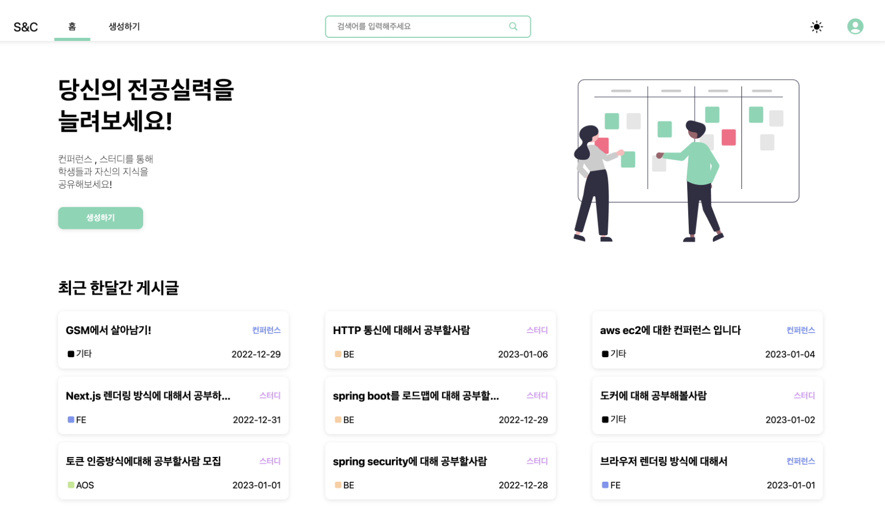

# 2022년

사실 1학년때까진 개발에 흥미가 별로 없었다. 전공을 프론트엔드로 잡았지만 잡은 이유도 사실 취업이 잘된다고 들어서 삼은 전공이였고 흥미가 있지도 않아서 열심히 하지도 않았고 거의 혼자공부해서 한 프로젝트도 다른 웹사이트 클론코딩한 프젝 밖에없었다.&#x20;

그래도 전공을 프론트엔드로 잡았으니까 방학때 토사관을 끝낸후 노마드코더 React 강의를 조금씩 들으면서 살고있었는데 아는선배한테 프로젝트 제안을 받아서 그때 첫 헙업프로젝트를 하게됬다.&#x20;

유지보수겸으로 참가하게 된 프젝이여서 맡은 일은 서비스이용약관/문의사항을 제작하는 일이였다. 개발은 단순 퍼블리싱이라서 어렵지 않았는데 git 을 진짜 저장소로만 써왔던지라 git flow 나 pr 에 대해서 하나도 몰랐다. 그래서 [친구](https://github.com/baekteun)의 도움(거의 대리)으로 첫 pr 을 날려봤다.

<figure><figcaption>
첫 pr <a href="https://github.com/Tita-dev/Tita-Client/pull/50">https://github.com/Tita-dev/Tita-Client/pull/50</a>
</figcaption></figure>

지금와서 보면 별거아닌데 그때에는 되게 신기하 진짜 개발자가 된 느낌이 들었다. 아마 이일로 열심히 하게 된 계기가 됬던것 같다.

그래서 1일1커밋 계획도 세우고 리액트를 다루는 기술같은 책도 공부했다.

방학이 끝나고 학교생활하면서는 React 공부한기술들도 익힐겸 프로젝트를 해보고싶었다.

그래서 친구들끼리 협업으로 프로젝트하면서 pr 충돌상황도 많이 겪어봤다.

개인 블로그도 만들고있었는데 프로젝트에 관심있어하는 백

월별 요약

### 1월 \~ 2월 (방학)

1월엔 토사관하고 방과후를 했다.

2월때  아는선배를 통해서 tita(~~사라진~~) 라는 프로젝트에 참가하게됬고 첫 협업과 pr 을 날리게됬다. 그전까진 개인공부만해서 git 을 잘 다룰줄 몰랐는데 이 경험을 통해서 git 에대해 더 공부하게됬고 공부자극을 많이 받았다. 그 뒤로 꾸준히 공부하고싶어서 이때부터 1일1커밋을 계획을 세줬다. 사실 이전에는 그냥 전공이라서 하는 느낌이였는데 이때이후로 코딩에 조금씩 재미를 느끼고 열심히 하기시작했던 시기인것같다.

### 3월

React 공부한걸 바탕으로 프로젝트를하던 시기였다.

&#x20;[DM](https://github.com/Diet-Management)(~~망한~~)이란 프로젝트를 통해 pr 을 많이날려봐서 충돌상황같은걸 많이 겪어볼 수 있었다.

그리고 개인블로그도 만들기 시작했다.

### 4월 \~ 7월

개인블로그를 하고있는데 블로그글들을 저장해둘 db 도 필요했고 마침 프로젝트에 관심있어하는 [백엔드 친구](https://github.com/SungGil-5125)를 만나서  [Devlog](https://github.com/HWANBINYOO/React-project/tree/main/vlog) 란 2인프로젝트로 만들기로했다.&#x20;

이프로젝트에서 CRUD, 인증로직, 배포를 다 처음구현해봐서 성공했을때 하이파이브하고 그랬던 기억이있다.

이때 배포하고나서 애들한테 처음 피드백을 받았는데 상당히 이슈가 많아서 힘들었다. 😓

### 8월 \~ 11월

이기간엔 웹소캣, Graphql, Next.js 강의를 보면서 새기술을 연습했다.

Devlog 를 next.js 로 마이그레이션했는데 ssr 환경에서 토큰관리를 어떻게해야될지에 대해서 몇주동안 이문제만 판적도 있다.

중간에 정보처리 산업기사도 땃다

### 12월

학교에서 아이디어페스티벌을하게되서 컨퍼런스와/스터디 향상을위해 홈베와 시청각실을 대여해주는  [S\&C ](https://github.com/Team-Meomi) 란 프젝으로 참가했다.

사실 프로젝트가 CRUD 가 전부였던지라 기능구현도 어렵지 않았고 이때 Dotori-v2 를 구상하고있던중이라 이 프젝에 Dotori-v2 에 들어갈 다크모드, SWR + SSR 같은  기술테스트를 많이 했다.(~~실험도구였다~~)

