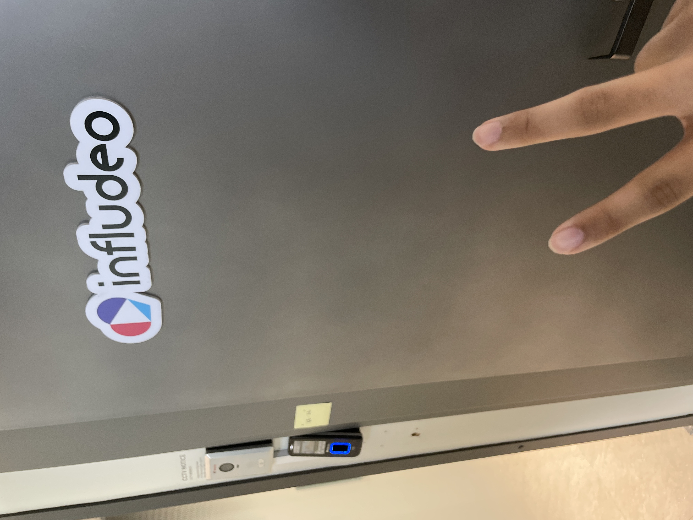
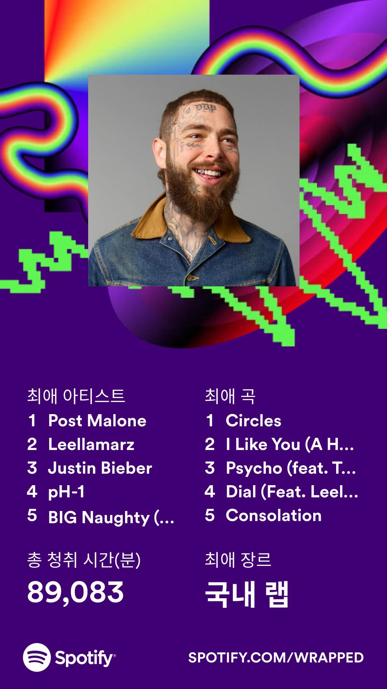

# 🤸♂ 2023년

2023 년 되니까 먼저 든 생각은 불안했다.

취업해야되는 학년이 된것도 있고 지금 취업할 실력인지도 잘 모르겠어서였던것 같다.

그래서 방학때는 최대한 todo mate 로 매일 할일을 적으면서 지냈던것 같다.

주로 프로그래머스 코딩테스트 문제를 풀거나 사이드 프로젝트하면서 지냈다.

.png>)

그리고 방학중에 드디어 도토리 디자인이 완성이 됬다고 해서 2월 3일 부터 [Dotori-v2](https://github.com/Team-Ampersand/Dotori-client-v2) 를 시작했다.

방학이라 프로젝트가 진행이 잘 되진않았지만 그래도 꾸준히 했던것 같다.

방학이 끝나고도 계속 했고 원래 배포일보다 늦쳐졌지만 주말인 4월 1일에 배포를 하기로했다.

기존프로젝트는 cloudfront 와 s3 를 사용해서 했지만 Next.js 에 ssr 기능이 적용안되서 배포를 빠르게 할 수 있는  vercel 로 하기로했다.

다른 프로젝트에서 미리해봤지만 그래도 이건 실제 학교서비스여서 좀 불안했던거같다. 다행히 베포는 잘 됬다.

근데 처음베포했을당시 속도가 너무 느렸고 이슈들이 너무 많이 나왔다. 그래서 한 몇일동안은 하루종일 이슈만 고쳤던것 같다. ([회고록](https://velog.io/@hawnbin/DOTORI-%ED%9A%8C%EA%B3%A0%EB%A1%9D))

한번은 ssr 을 적용했는데 아무리생각해도 초기렌더링이 너무느린거같아 vercel 설정을 파봤는데

<figure><figcaption>
Functions Setting
</figcaption></figure>

여기 지역이 미국으로 되있었다; 그래서 지역을 한국으로 바꿨더니 속도가 2\~3배 빨라졌던 기억이있다.

웹사이트가 안정화되고 나서 포폴과 기술공부를 하면서 회사에 지원하기 시작했다.

## 취업

처음엔 쉽지 않았다. 알고는 있었지만 자꾸 서류에 떨어지는걸보고 부족한점을 채워가면서 포폴을 계속 수정해나갔다.

그러다 운 좋게 2번 면접을 보게 되었고

#### 슬로그업 (5월 11일)

이 회사는 기업설명회와 탐방회도 있었는데 안가고 면접만 참여하게됬다.

들어가고싶은 마음도 있었지만 면접경험해보고싶어서 지원한것도 있었다.

첫 면접이라서 무엇을 물어볼지 잘 몰라 일단 기본적인 프론트 기술이랑 인성질문을 준비해갔었다.

면접질문은 포폴관련질문이나 개발관련해서 힘들었던점같은 대화형식으로 했다. 그래서 생각보다 어렵지 않았는데

그때 dotori home 페이지에 ssr 과 promise all 을 사용해서 데이터를 받아오는데 이요청중에 1개라도 에러뜨면 홈페이지에 안보일거같은데 어떻게 해결할 수 있을까요? 라는질문에 대답을 못했던게 기억이 난다.

사실 csr 로 한번더 받아와서 홈페이지가 안보이지는않는데 당황해서 대답을 못했던것 같다.

이 면접을 통해서 내가 프로젝트에 사용하는기술에대해 더 자세히 공부하는 시간을 가지게됬다.

#### 인플루디오 (5월 25일)

이 회사는 병특도 되고 안정적인 서비스가있어서 지원했다. 운좋게 서류합격후 면접을 봤다.

면접을 구글화상통화로봤는데 마이크오류가있어서 전화로 말했던게 기억이난다.

이번엔 인성면접할때 말을 조금 절었는데 기술질문과 꼬리질문에서 그나마 막히지않고 잘 대답했던거 같다.

그때 포폴시행착오에 Promise.all 을 사용한걸 적었는데 그거로 면접관님이 비동기처리관련해서 꼬리질문을 연달아서 했던게 기억난다.

30분정도 면접이 끝나고

다음날 합격됬다고 연락이왔다.

취업한후에는 토이프로젝트 몇개하면서 놀았던 것 같다.

사실 취업하기전까지 취업에대한 불안감이 계속 달려있어서 맘 놓고 쉬지를 못했는데 취업하고 풀렸던것 같다.

## 현장실습 (10.4 \~ 11.1)

<figure><figcaption></figcaption></figure>

추석이끝나고 드디어 회사에 갔다.

회사에선 개발환경세팅하고 바로 실무로 들어갔다.

첫날은 포카마켓 키오스크 웹페이지 코드분석했고

둘째날은 키오스트 웹페이지를 반응형, 기능구현을하는 작업과 이벤트페이지작업을 가지고 플래너를 짯다.

이처럼 과제없이 바로 실습으로 들어가서 좀 놀랐지만 학교애서 해볼 수 없는 기술을 해 볼 수 있어서 좋은 경험이라고 생각하면서 했다.

* 키오스크 웹페이지
  * 테블릿 반응형
  * 메인페이지 상태관리
  * 결제페이지
    * 상태관리
    * 결제처리
* 이벤트페이지

정도를 했다.

한번은 개발하던중에 웹소캣로직 관련해서 이슈를 해결하고있었는데 이슈해결에만 집중하느라 소캣을 useEffect 밖으로 뺀적이있는데 그러자마자 개발서버가 터져서 다른분들한테까지 영향이 끼친적이 있다;

다행히 마지막날까지 마무리가 잘됬긴했는데 사수분이 많이 도와주셨다.

한달동안 회사에서 일해봤는데 회사에 처음가는거라 적응하는데 시간이 좀 걸렸고 아침잠 이겨내는게 제일 힘들었다.

실무 하면서 아직 로직분리에 대한 생각이 부족하다고 생각했고 알고리즘이나 기술공부를 좀 더 해야겠다고 생각됬던 한달이였다.

## 다시학교

다른 사람들은 보통 11월에 계약을 맺는데 나는 병특제도 받기위해서 내려오게 됬다.

중간에 좀 여러 과정이 있었어서 힘들게 될 수도 있었지만 결국 병특받고 2월에 입사하게 되서 좋게됬다.

그래서 이기간에 알고리즘이나 기술공부를 더 하기로 마음먹고

학교들어와서 초반에는 [프로그래머스 코딩테스트 고득점 Kit](https://school.programmers.co.kr/learn/challenges?tab=algorithm\_practice\_kit) 을 계속 풀었다.

초반엔 어려워서 제대로 못풀었는데 몇번 풀다보니까 다행히 감을 잡고 어느정도 풀 수 있게 됬다.

한번은 dfs 문제가 나왔는데 js 는 지원을 안해서 재귀함수를 이용해 풀었어야되는데 답지를 보고도 이해를 못해서 친구들이랑 기숙사에서 그 코드 이해만 몇시간을 한 적이있다.

풀다가 알고리즘 푸는게 좀 질릴때쯤  Next.js 14 버전도 나왔고 기술공부도 하고싶어서 1월에했던 사이드 프로젝트를 [WTM](https://tim-v2.netlify.app/) 로 이름바꿔 v2 로 다시만들었다.(WTM 회고록)

## 마무리

다른사람들이 회고록같은거 쓰는거보면서 나도한번 정리해보는것도 좋을거같다 생각이들어서 쓰게됬는데&#x20;

쓰면서 올해 뭐했는지도 더 생각하게됬고 동기부여도 더 얻은것 같다.

<figure><figcaption>
2023 #GitHubUnwrapped 중
</figcaption></figure>

<figure><figcaption>
2023 Spotify 연말결산
</figcaption></figure>

## 월별정리

#### 1월

코테, 사이드 프로젝트

#### 2\~3월

dotori-v2

#### 4월

dotori-v2 안정화, 포폴제작, frontend 공부&#x20;

#### 5월

면접 2번

취업

#### 6월 \~ 9월

사이드 프로젝트 몇개

휴식

#### 10월

현장실습

#### 11월 \~ 12월

알고리즘, WTM

